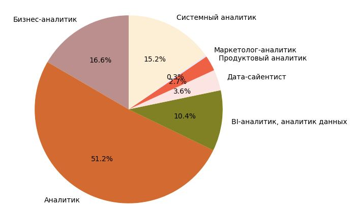
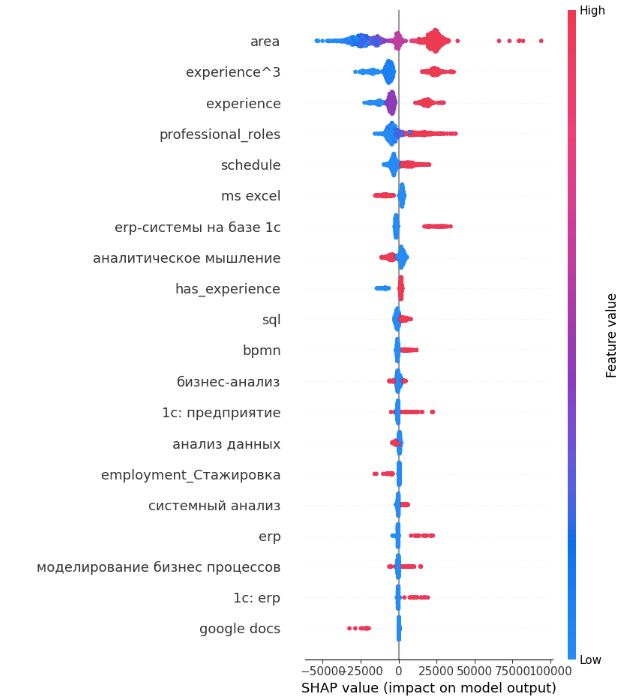

# SalaryWise

**Описание**

* Cервис, который предсказывает зарплату по резюме для профессий **в сфере Data Science**. Пользовательский интерфейс для сервиса представляет собой телеграм бот. Пользователь имеет свой личный кабинет, может сделать 2 запроса в день без снятия кредитов со счета. Пользователь загружает свое резюме в формате .pdf и получает прогноз своей зарплаты. **Анализ прогноза:** пользователь может увидеть, какие навыки повышают его зарплату, а также получает рекомендации навыков для изучения, которые алгоритм счел полезными для повышения зарплаты. 

**Функциональность:**

* Telegram-бот: Пользовательский интерфейс, через который осуществляется взаимодействие с сервисом. 
* Личный кабинет: Предоставляет доступ к истории запросов, прогнозам зарплаты и рекомендациям.
* Бесплатный доступ: Пользователь может сделать 2 запроса в день бесплатно.
* Загрузка резюме: Пользователь загружает свое резюме в формате .pdf.
* Прогноз зарплаты: Сервис выдает прогноз зарплаты пользователя на основе его резюме.
* Анализ прогноза: 
    * Показывает навыки, которые положительно влияют на предсказанную зарплату.
    * Предоставляет рекомендации по изучению новых навыков для повышения зарплаты. 

Ветка **branch_1** отражает процесс предобработки данных 

1. Произведен парсинг с сайта hh.ru, данные представлены в **uni_data.csv**;

2. Проделан анализ данных. Предобработанные данные для сплита представлены в **for_split.csv**;

3. Архитектура модели улучшена с помощью Optuna;

4. Обработка прогноза для дальнейшего использования в сервисе проведена с помощью библиотеки SHAP values (как признаки воздействуют на спрогнозированную зарплату — положительно или отрицательно);

Ветка **tracking** отражает трекинг экспериментов

Произведен трекинг экспериментов (ClearML), выбрана модель с лучшими метриками.

Ветка **branch_2** содержит сервис, упакованный в docker контейнер. 

1. Реализовано хранение данных за счет СУБД - данные пользователя, история транзакций;

2. Реализован REST интерфейс для взаимодействия с сервисом;

3. Тяжеловесная модель помещена на удаленное хранилище, при сборе контейнера она пуллится с GoogleDrive;

4. Пользовательский интерфейс - телеграм бот, написанный на aiogram;

5. Применен инструмент асинхронной обработки задач Celery. Есть возможность масштабирования воркеров;

6. Критические части сервиса покрыты юнит тестами;

7. Сервис упакован в docker контейнер
